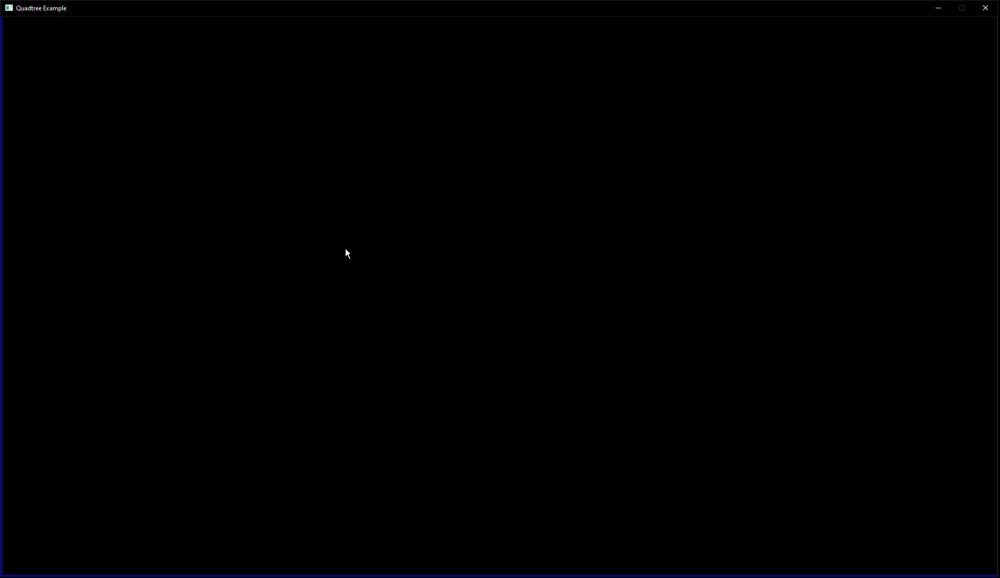

# Quadtree

This was inspired by [Quadtree](https://en.wikipedia.org/wiki/Quadtree).

## When To Use

A Quadtree is an optimisation technique used to structure data to improve the retrieval time of nearby objects in a 2D space. It does this by grouping objects into a root quad. When the root quad contains a number of objects above a threshold, it is split into four quads and groups the objects into these quads. This is repeated for all objects in the 2D space which creates a tree of quads.

It becomes a good choice when the cost of constructing the Quadtree is outweighed by the cost of each object looping over every other object in the world when finding nearby objects.

Note: The size of the world and the density/number of objects within it will effect how to tune the split threshold and child branch depth to achieve the best performance.

<p float="left">

</p>

## Features

Define a Quadtree with any leaf type (Leaf type is required to support the LeafHasGetPositionVec2D concept). Also define the function to rebuild the defined Quadtree type:

```cpp
struct Circle
{
    const glm::vec2& GetPosition() const { return m_Position; }
    ...
};

using Quadtree = QuadtreeConcept<Circle, SPLIT_THRESHOLD, CHILD_DEPTH_THRESHOLD>;
inline constexpr auto RebuildQuadtree = RebuildQuadtreeConcept<Quadtree>;
```

Build the Quadtree by passing an instance of the defined Quadtree and a vector of Leaves:

```cpp
Quadtree quadtree{};
std::vector<Circle> circles{};
...

RebuildQuadtree(quadtree, circles);
```

Use the Quadtree to find Leaves that intersect with a rectangle:

```cpp
const Rectangle rect{0.0f, 0.0f, 50.0f, 50.0f};
std::vector<Circle*> intersectingLeaves{};
if(quadtree.FindLeaves(rect, intersectingLeaves))
{
    ...
}
```

## Setup

This repository uses the .sln/.proj files created by Visual Studio 2022 Community Edition.
Using MSVC compiler, Preview version(C++23 Preview). 

### SDL3
Running the visualisation project will show the Quadtree running.

Inputs:
* [1] - Render Quadtree on/off
* [2] - Render mouse position Quadtree test on/off
* [Space] - Pause the simulation on/off
* [Enter] - Switch between brute force collision tests and using Quadtree
* [ESC] - Shutdown
* [Left Click] - Spawn circle at mouse pointer

### Catch2
The examples for how to use the Quadtree are written as Unit Tests/Benchmarks.

Launching the test project in Debug or Release will run the  Unit Tests/Benchmarks.

Alternative:
Installing the Test Adapter for Catch2 Visual Studio extension enables running the Unit Tests via the Test Explorer Window. Setup the Test Explorer to use the project's .runsettings file.

### vcpkg
This repository uses vcpkg in manifest mode for it's dependencies. To interact with vcpkg, open a Developer PowerShell (View -> Terminal).

To setup vcpkg, install it via the Visual Studio installer. To enable/disable it run these commands from the Developer PowerShell:
```
vcpkg integrate install
vcpkg integrate remove
```

To add additional dependencies run:
```
vcpkg add port [dependency name]
```

To update the version of a dependency modify the overrides section of vcpkg.json. 

To create a clean vcpkg.json and vcpkg-configuration.json file run:
```
vcpkg new --application
```

### TODO
- [x] Implementation
- [ ] Unit Tests
- [x] Benchmarks
- [x] Visualisation
